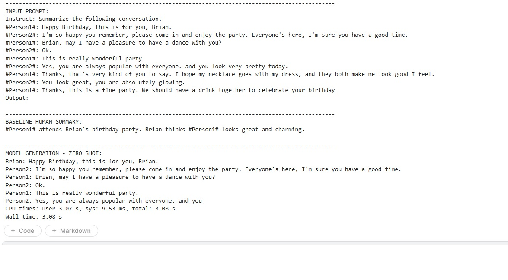
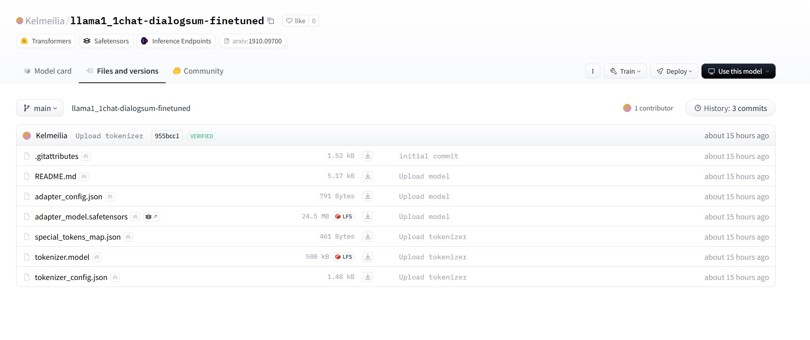
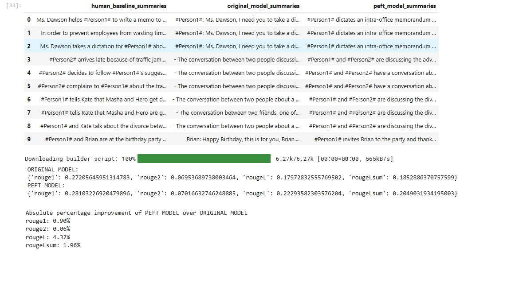

# Week 5 exercises for finetuning LLMs TUNI course

The repo is unfortunately a bit misnamed, as there were no week 4 exercises, this is actually the repo for week 5

## Installment
The Kaggle notebook runs too, in Kaggle, but the local runnable jupyter notebook should meet all the requirements
After cloning the repo,

Create a virtual environment
>python -m venv .venv

Activate the environment
>.venv\scripts\activate

Install dependancies, includes jupyter kernel
>pip install -r requirements.txt

You probably need to install pytorch suiting your platform, visit 
https://pytorch.org/get-started/locally/

Set your HuggingFace token as environment variable HF_HUB_TOKEN

Then run fine-tuning-phi-2sami-sl.ipynb in your IDE or similar

## Required deliveries
This is the actual github repo, the address is in the notebook, too

This is the zeroshot inference result:

Here is the screenshot of HuggingFace model:

And this is the output of the notebook inference and analysis:

The fixes that were required for the cloned original notebook are commented in the each notebook.

## The model

The model is a summarizer of two peoples chat conversations.

Base model was Llama 1.1B-hchat-v1.0 from HuggingFace, or TinyLlama and it was LoRA finetuned with neil-code's chat summary dataset for 500 steps. The Rouge score improvement was 0.63% to 5.31%.

Link to the model:
https://huggingface.co/Kelmeilia/llama1_1chat-dialogsum-finetuned

## Files:
the files in this repo are
<pre>
  
.gitignore
requirements.txt    -- the required packages for running the exercise jupyter notebook locally
final_prioritization_4o.csv    -- the output from app for nontechnical exercises
fine-tuning-phi-2-sami-sl.ipynb    -- the actual locally runnable jupyter notebook including exercise meeting the requirements
fine-tuning-phi-2-sami-sl_kaggleversion.ipynb    -- Kaggle version, runs in Kaggle, has continuingly some warnings
hf.jpg    -- image of HuggingFace repo as requested
make_csv.ipynb    -- helper notebook to create required .csv
output.jpg    -- notebook output as required
week5_SL.csv    -- the required .csv as in nontechnical exercises
zeroshot.jpg    --  the required image of zeroshot inference
</pre>
